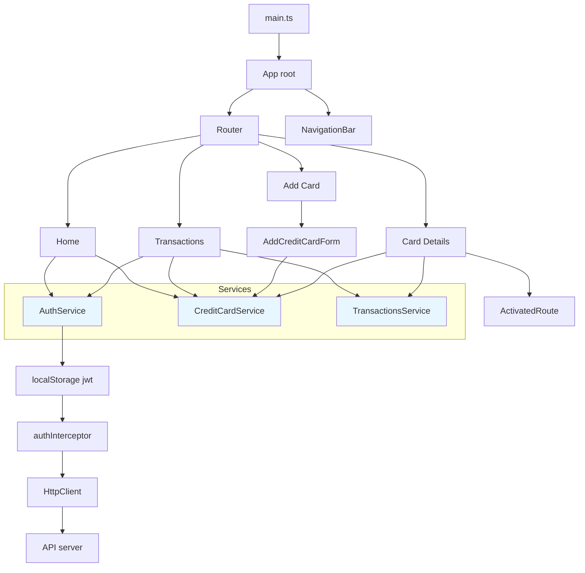

# Architecture & Data Flow — Handin1

This document explains how the small Angular (standalone components) application is structured and how data flows between parts. It includes a diagram (Mermaid) and a step-by-step textual walkthrough for common user flows.

## What I scanned to build this
- `src/main.ts` — app bootstrap
- `src/app/app.ts` — root App component
- `src/app/app.routes.ts` — application routes
- `src/app/app.config.ts` — providers (Router, HttpClient + interceptor)
- Services: `auth-service.ts`, `credit-card-service.ts`, `transactions-service.ts`
- Screens: `home`, `transactions`, `add-credit-card`, `credit-card-details`
- Forms: `add-credit-card-form`, `add-transaction-form`
- Lists: `credit-card-list`, `transactions-list`
- `auth-interceptor.ts` — adds JWT to HTTP requests
- Interfaces and pipes used by components

## High-level diagram (Mermaid)

> If your editor supports Mermaid, the diagram above will render visually. If not, the following section explains the connections clearly.

## Written explanation — components and flow

1) Application bootstrap
- `src/main.ts` calls `bootstrapApplication(App, appConfig)`.
- `appConfig` registers the router (`provideRouter(routes)`) and `provideHttpClient(withInterceptors([authInterceptor]))` so the HttpClient will always run the `authInterceptor`.
- The `App` component (`src/app/app.ts`) is the root of the UI and contains the `<router-outlet>` and `NavigationBar`.

2) Router and Screens
- `src/app/app.routes.ts` defines routes:
  - `/` maps to `Home` (eager)
  - `/transactions` maps to `Transactions` (eager)
  - `/cards/:cardNumber` lazy-loads `CreditCardDetails` component
  - `/add` maps to `AddCreditCard`
- When the URL changes, Angular constructs the corresponding screen component and places it in the `RouterOutlet`.

3) Key services and the API
- `AuthService` (singleton, providedIn: 'root') manages login and JWT storage:
  - `login()` posts credentials to `${API}/Login` and stores the returned token in `localStorage`.
  - Exposes `isAuthenticated` as a signal.
  - `autoLoginAndRun(onSuccess, onError)` is used by screens to ensure a token exists (it will login with hard-coded credentials for this assignment if needed).
- `CreditCardService` provides `getAll()`, `getByCardNumber()`, `add()` and `delete()` — it calls the API endpoints under `${API}/CreditCard`.
- `TransactionsService` provides `getTransactions()`, `deleteTransaction(uid)`, `addTransaction(t)` — calls `${API}/Transaction`.
- `auth-interceptor` reads `localStorage.jwt` and, if present, clones outgoing HTTP requests adding `Authorization: Bearer <token>` header.

4) Reactive state and UI updates
- The app uses Angular signals (e.g., `signal()`, `computed()`, `effect()`) rather than a larger external state library.
- Example: `Home` component stores `cards = signal<CreditCard[] | null>(null)` and updates it when `CreditCardService.getAll()` returns. UI templates read `cards()` to render the list.
- `Transactions` keeps `transactions = signal<Transaction[]>([])` and `filteredTransactions = computed(...)` for a view derived from state.

5) Forms & child components
- `AddCreditCardForm` uses `ReactiveFormsModule` to validate and collect input, builds a `CreateCreditCard` payload, and calls `CreditCardService.add(payload)` on submit. On success, it navigates to `/`.
- `AddTransactionForm` is a standalone component that exposes `input()` properties for `cards` and `pending` and an `output()` event `create` that the `Transactions` screen listens for. When the form emits `create`, `Transactions.onCreateTransaction` calls `TransactionsService.addTransaction()` and updates the `transactions` signal.
- `CreditCardList` and `TransactionsList` are presentational list components that accept `input()` data and emit `output()` events (for delete actions) that parent screens handle.

6) Optimistic updates and rollback
- When deleting a transaction from `Transactions` or from `CreditCardDetails`, the code performs an optimistic UI update:
  - Snapshot current list, remove item from the signal so the UI updates immediately.
  - Call `TransactionsService.deleteTransaction(uid)`. If it fails, rollback by restoring the snapshot.
- This pattern improves perceived responsiveness but must handle failure paths by restoring state.

7) Lazy loading
- The route for `/cards/:cardNumber` lazy-loads `CreditCardDetails` with the `loadComponent` function. This means the code for that screen is only downloaded when a user opens a card detail page.

## Typical user flows (step-by-step)

A. App start / Home
- Browser open -> `main.ts` bootstraps `App` -> Router activates `Home`.
- `Home.ngOnInit()` sets loading=true and calls `authService.autoLoginAndRun(..., ...)`.
  - If not authenticated, `AuthService.login()` POSTS credentials, stores token in `localStorage` and sets `isAuthenticated` signal true.
  - On success, `Home.fetchCards()` calls `CreditCardService.getAll()` which returns an Observable of cards; on next the `cards` signal is set and UI renders `CreditCardList`.
- Browser's HttpClient automatically runs `authInterceptor` to attach JWT header.

B. Viewing transactions
- Navigate to `/transactions` -> `Transactions.ngOnInit()` ensures auth via `autoLoginAndRun`. On success, it calls `getTransactions()` and `getAll()` (to get the possible cards for the add form).
- `TransactionsList` presents the list. Deletion flows from the list to parent screen via `output()`.
- Adding a transaction: `AddTransactionForm` emits `create` with `CreateTransaction` payload -> `Transactions.onCreateTransaction` calls `TransactionsService.addTransaction()` and prepends the returned transaction to the `transactions` signal.

C. Card details and deletion
- Navigate to `/cards/<cardNumber>` -> `CreditCardDetails` lazy loads; uses `toSignal(route.paramMap.pipe(map(...)))` to create a signal for the route param.
- Effect reacts to the param signal and calls `CreditCardService.getByCardNumber()` -> sets `card` signal.
- Deleting a card calls `CreditCardService.delete()` and on success navigates home.
- Deleting a transaction inside a card does optimistic update on `card.transactions` and calls `TransactionsService.deleteTransaction()`; rollback on error.

## File map (where to look)
- Boot & config: `src/main.ts`, `src/app/app.config.ts`, `src/app/app.routes.ts`, `src/app/app.ts`
- Screens: `src/app/components/screens/*` (home, transactions, add-credit-card, credit-card-details)
- Reusable parts: `src/app/components/forms/*`, `src/app/components/lists/*`, `src/app/components/navigation-bar/*`
- Services: `src/app/services/*` (auth-service, credit-card-service, transactions-service)
- Interceptor: `src/app/interceptors/auth-interceptor.ts`
- Interfaces: `src/app/interfaces/*`

## Important implementation details & gotchas
- Auth is done by storing JWT in `localStorage` and using an interceptor to attach the token. Any code reading the token uses `localStorage.getItem('jwt')`.
- Many components rely on `AuthService.autoLoginAndRun(...)` to ensure the token is present. This implementation auto-logins with default credentials for this assignment — in a real app you'd use proper user login flows.
- The app uses Angular standalone components (no NgModule). Look for `standalone: true` and `imports: [...]` in components.
- Reactive patterns: Signals are used. Remember to call signals as functions when reading them in templates or code (`this.cards()`), and use `computed()` and `effect()` for derived values and reactive side-effects.
- Routes: `loadComponent` lazy loads the details screen which reduces initial bundle size.

## Quick glossary (terms used in the code)
- Signal: lightweight reactive primitive (state holder) from `@angular/core` used like `const s = signal(null); s.set(x); s()`.
- effect(): runs side-effects when signals used inside it change.
- computed(): derived value that recalculates automatically when dependencies change.
- toSignal(): converts an RxJS observable (route param map) to an Angular signal.
- input()/output(): small helper decorators used in these standalone components for typed pub/sub between parent and child.

## Where to look next / suggested edits
- Add inline comments in `transactions.ts` and `credit-card-details.ts` around optimistic updates to clarify rollback logic.
- Consider centralizing API base URL (`API`) in one config file so tests and environment switches are easier.
- Replace hard-coded `AuthService` default credentials with a real login page for production.

---

If you want, I can also:
- Produce a PNG/SVG rendering of the Mermaid diagram and add it to the repo (useful if your viewer doesn't render Mermaid).
- Create quick inline diagrams for each screen (component tree) as separate images or markdown sections.
- Add comments into the codebase to link to this `ARCHITECTURE.md`.

Which of those would you like next?